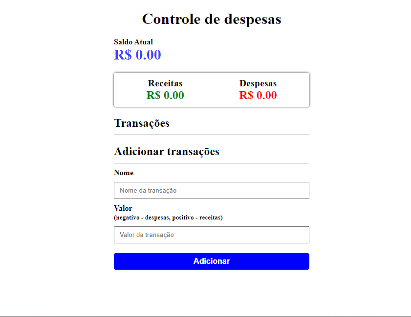

<h1>Controle de Despesas</h1>

Um controle de despesas onde adicionamos o valor da transação e nome dela, mostra o saldo somando o valor da despesas e receitas junto, e também tem o saldo de despesas e saldo de receitas separados, mostramos nossa lista de transações, e nossa transações fica salvas no localStorage.

## Tecnologia utilizada

- JavaScript
- HTML5
- CSS3